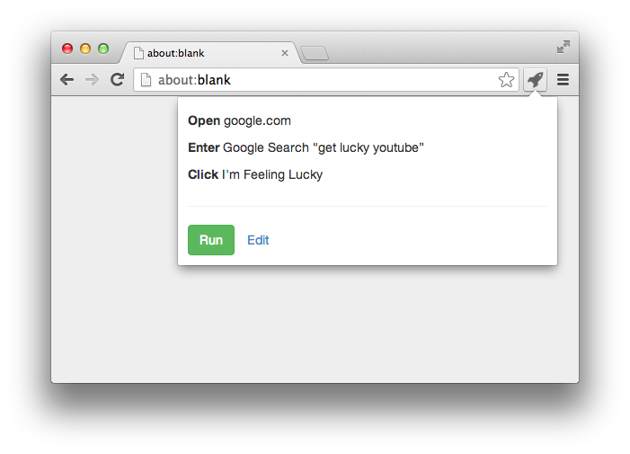

# Sidekick

The simple way to automate tasks.

## Actions

### Open

Opens a website. Just pass a URL.

### Click

Clicks a link or button.  Pass the text or a CSS selector.

### Enter

Enters data in a form.  Works with all types of user input, including text boxes, check boxes, and dropdowns.

## Privacy

Sidekick requires permission to:

- Access your data on all websites
- Access your tabs and browsing activity

Sidekick does not record **any** of this data.

## Contributing

1. Clone the project
2. Navigate to `chrome://extensions`
3. Make sure “Developer Mode” is checked
4. Click the “Load unpacked extension” button and select the project
